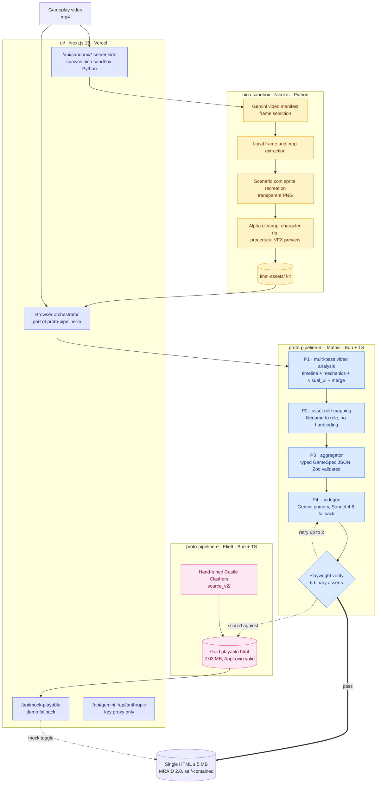

# Voodoo × Anthropic Hackathon · Track 2

> 🏆 **Winner · Track 2 (Automate Playable Ads Creation)**
> Voodoo × Anthropic Hackathon · 2026-04-25 to 2026-04-26 · 30h
> Team **E220** · [Nicolas Grimaldi](https://github.com/NgrimaldiN), [Mathis Villaret](https://github.com/Mathis-14) [Eliott Valette](https://github.com/eliottvalette), 

A generic pipeline that turns **any gameplay video** into a **single-file HTML playable ad** that drops straight into AppLovin Playable Preview (no CDN, no iframe, ≤ 5 MB, MRAID 2.0 ready).

**Live slides (animated pitch deck):** [anthropic-voodoo-hackathon.vercel.app](https://anthropic-voodoo-hackathon.vercel.app/)

Castle Clashers (2D) is the imposed demo. Block Blast (2D) and Epic Plane Evolution (3D) prove generalisation.

---

## Architecture

The repo holds three teammate pipelines and one Next.js app that composes them at runtime. The graph below is the full picture.



**How to read it.** The live UI is the composition node. It runs Nico's Python asset extractor server-side, runs Mathis's orchestration logic client-side (a TS port of `proto-pipeline-m`), proxies Gemini and Anthropic calls through thin server routes for key safety, and exposes Eliott's hand-tuned gold Castle Clashers playable behind a mock toggle for demo redundancy. Eliott's gold playable also acts as the **anchor reference** that the `proto-pipeline-m` benchmark scores generated playables against.

---

## The three pipelines

### `nico-sandbox/` · Video to asset kit (Nicolas)

Strict input: one gameplay video, nothing else. Output: a complete sprite, character, and VFX kit ready to drop into a playable.

Stack: Python 3.11+, Gemini, Scenario.com.

Stages: Gemini video manifest (which frames matter) → local frame and crop extraction → Scenario.com Gemini-reference sprite recreation → Photoroom/Pixa alpha cleanup → padding trim. Characters take the B11 skeleton-proven route (clean full-body seed → 4×2 parts sheet → local part slicing → `rig.json`). VFX use a procedural route (Gemini VFX analysis → particle config JSON → TypeScript helper + `preview.html`). Backgrounds use opaque plate-cleanup, not alpha removal.

Runs are checkpointed in `manifests/05_scenario_automation_manifest.json` and resumable. Detailed flow: [`nico-sandbox/README.md`](./nico-sandbox/README.md).

### `proto-pipeline-m/` · Orchestrator + benchmark (Mathis)

The generic pipeline. Four Gemini stages with Zod-typed contracts at every seam, a Playwright verify loop with six binary asserts and up to two retries, and a benchmark runner that sweeps prompt variants on the same corpus.

Stack: Bun, TypeScript (ESM, strict), Zod, Playwright.

Three layers:
- **Engine** (`src/engine/`): generic, hand-written. MRAID 2.0 shim, Canvas2D bootstrap, input handler, asset loader, scaler. Never LLM-generated.
- **Templates** (`src/templates/`): overfit-OK, one file per `template_id`. Each exports `assetSlots` (roles), `paramSchema` (Zod), and `render(spec, assets, params, creativeSlot): string`.
- **Spec** (LLM-driven): Gemini multi-pass produces a typed `GameSpec` JSON, validated before downstream consumption.

By default the orchestrator consumes Nicolas's asset bank: `DEFAULT_BANK = "../nico-sandbox/runs/B11/final-assets"`. Detailed contracts and CLI: [`proto-pipeline-m/CLAUDE.md`](./proto-pipeline-m/CLAUDE.md), phase-by-phase plan: [`proto-pipeline-m/PLAN.md`](./proto-pipeline-m/PLAN.md).

### `proto-pipeline-e/` · Gold-target reference (Eliott)

A hand-tuned Castle Clashers playable used in two roles:

1. **Gold reference for the benchmark.** The verify harness in `proto-pipeline-m` scores generated playables against this known-good output (`proto-pipeline-e/targets/castle_clashers_gold/source_v2/dist/applovin_playable.html`, 2.03 MB, AppLovin-valid).
2. **Codegen prompt incubator.** The prompt shapes that landed in `proto-pipeline-m/prompts/` and ultimately in the live UI were first proven here.

Stack: Bun, TypeScript.

It also doubles as the demo's **safety net**: `/api/mock-playable` in the UI returns this gold HTML when the live pipeline is toggled to mock mode.

---

## How the live UI composes the three pipelines

The Next.js app at [`ui/`](./ui) is **not a fourth pipeline**. It is a runtime composition of the three above.

| User-visible step | Where it runs | Backed by |
|---|---|---|
| Drop video into the dashboard | Browser | `ui/app/page.tsx::uploadVideoForAnalysis` chunks to `/api/sandbox/runs/{start,chunk,finalize}` |
| "Asset Generation" stage | Server (Node) | `ui/utils/sandboxBackend.ts` spawns `python ../nico-sandbox/scripts/run_full_asset_pipeline.py` and polls manifests |
| Probe, P1 Video, P2 Assets, P3 GameSpec | Browser | `ui/lib/pipeline/{probe,p1-video,p2-assets,p3-aggregator}.ts` (TS port of `proto-pipeline-m/src/pipeline/`) |
| Gemini, Anthropic, Voxtral calls | Server proxy | `/api/gemini`, `/api/anthropic`, `/api/voxtral` (key safety only, no logic) |
| P4 Codegen and Verify | Browser | `ui/lib/pipeline/{p4-codegen,assemble,verify-iframe}.ts` |
| Mock playable toggle | Server | `/api/mock-playable` reads `proto-pipeline-e/targets/castle_clashers_gold/dist/playable.html` |
| Polish pass (gesture, audio) | Server | `/api/polish`, `ui/lib/polishInjection.ts` |

Prompt variants are loaded from `ui/public/prompts/<variant>/*.md`, themselves symlinked from `proto-pipeline-m/prompts/`. Editing a prompt in one place updates both the CLI benchmark and the live UI.

So the runtime equation for the live demo is:

```
LIVE_UI = nico-sandbox (server-side, assets)
       + proto-pipeline-m logic ported to browser TS (orchestration, codegen, verify)
       + proto-pipeline-e gold playable (mock fallback)
```

---

## AppLovin compliance · the 7 hard rules

Every generated playable is checked against:

1. Single self-contained HTML, ≤ 5 MB
2. No `<iframe>`, no external script/link/img refs (except `mraid.js`)
3. `<script src="mraid.js">` in `<head>`
4. MRAID `ready` listener wired
5. CTA goes through `mraid.open()` (with `window.open` fallback for previews)
6. `<meta name="viewport">` present
7. No `document.write`

Run the checker:

```bash
node --experimental-strip-types scripts/verify-applovin.mts [path...]
# With no args, scans slides/public/ + proto-pipeline-{m,e}/outputs/
# Exit 0 if every checked file passes, 1 otherwise.
```

---

## Quick start

### Prerequisites

- Node ≥ 22 (Node 25 strips TypeScript natively for `verify-applovin.mts`)
- Bun (for `proto-pipeline-{m,e}`)
- Python 3.11+ with a venv at `.venv/` (for `nico-sandbox`)
- API keys in `.env` at repo root, see [`.env.example`](./.env.example):

```bash
GEMINI_API_KEY=...
SCENARIO_API_KEY=...
SCENARIO_API_SECRET=...
SCENARIO_TEAM_ID=...
SCENARIO_PROJECT_ID=...
# For ui/ additionally:
ANTHROPIC_API_KEY=...
NEXT_PUBLIC_SUPABASE_URL=...
NEXT_PUBLIC_SUPABASE_ANON_KEY=...
```

### Run the pitch deck

```bash
cd slides && npm install && npm run dev
# → http://localhost:3001
```

### Run the live demo UI

```bash
cd ui && npm install && npm run dev
# → http://localhost:3000
# Requires the .venv with nico-sandbox dependencies installed
```

### Run the orchestrator (Mathis)

```bash
cd proto-pipeline-m && bun install

# Single end-to-end run
bun run pipeline --run my-run \
  --video "../ressources/Castle Clashers/Video Example/B11.mp4" \
  --assets ../nico-sandbox/runs/B11/final-assets

# Verify a built HTML
bun run verify outputs/my-run/playable.html

# Benchmark batch (3 prompt variants × 2 videos)
bun run bench --variants v1,v2,v3 --videos b01,b11
```

### Run the asset extractor (Nico)

```bash
.venv/bin/python nico-sandbox/scripts/run_full_asset_pipeline.py \
  "ressources/Video Example/B11.mp4" \
  --out nico-sandbox/runs/B11_full
```

For full quality: `--resolution 1K --num-outputs 4`. Resumable; use `--force` to regenerate.

---

## Benchmark methodology

Detailed protocol in [`proto-pipeline-m/BENCHMARK.md`](./proto-pipeline-m/BENCHMARK.md).

Headline metrics per run:

| Metric | Type | Source |
|---|---|---|
| `runs` | binary 0/1 | Verify harness, 1 iff all 6 binary asserts green |
| `user_note` | int 1 to 5 | One reviewer, ≤ 1 min, fixed rubric |

Per-stage cost and latency are logged (tokens in/out, wall-clock ms) and aggregated per batch.

The 6 binary verify asserts:

1. File size ≤ 5 MB
2. Headless Chromium loads with zero `console.error`
3. Canvas pixel-hash differs from background after 1 second
4. `mraid.open(` is reachable from the CTA element
5. The `mechanic_name` from the GameSpec appears verbatim in the HTML JS source
6. Tap and drag at canvas centre changes a tracked state value

The benchmark scores generated playables against `proto-pipeline-e`'s gold Castle Clashers playable (the anchors edge in the architecture diagram).

---

## Reusable Canvas-2D bank · `utils/`

Framework-free pieces the codegen step (or a human) can paste into any playable:

- **VFX**: smoke, burst, shake, float-text, debris, particles
- **HUD**: VS-bar, HP segmented, HP percentage, timer
- **End screens**: game-lost, game-won, try-again, animated win/game-over moments
- **Mechanics**: drag-release, camera-lerp, CTA trigger (VSDK → MRAID → postMessage → `window.open` cascade)

Indexed in [`utils/catalog.json`](./utils/catalog.json) so the pipeline can pick pieces by name. Full reference: [`utils/README.md`](./utils/README.md). 3D building blocks live in [`utils-3d/`](./utils-3d/).

---

## Demo targets

| Game | Render | Source video | Generated playable |
|---|---|---|---|
| Castle Clashers | 2D Canvas | `ressources/Castle Clashers/Video Example/B11.mp4` | `slides/public/castle_clashers.html` |
| Block Blast | 2D Canvas | provided gameplay capture | embedded in slide 3 via iframe |
| Epic Plane Evolution | 3D Three.js | provided gameplay capture | `slides/public/airplane-evolution.html` |

All three are AppLovin-compliant single-file HTML, ≤ 5 MB, generated live by the UI during the pitch.

---

## Vercel deployment

The animated pitch deck is deployed on Vercel. The `ui/` dashboard ran locally during the demo (it shells out to the Python `nico-sandbox` runtime, which is not Vercel-friendly).

| Vercel Project | Root | URL |
|---|---|---|
| `anthropic-voodoo-hackathon` | `slides/` | [anthropic-voodoo-hackathon.vercel.app](https://anthropic-voodoo-hackathon.vercel.app/) |

`slides/vercel.json` pins `"framework": "nextjs"` to prevent drift to the `Other` preset.

---

## Jury axes · Track 2

Equally weighted:

- **Quality**: clear core loop, smooth on mobile, visual and audio polish, AppLovin compliance.
- **Speed**: speed and ease of producing a variation.
- **Process robustness**: configurable parameters, generalises to another game or another video.
- **AI usage and creativity**: AI across the whole workflow (video analysis, codegen, asset creation), originality in automation.

Our differentiation: pipeline genericity (not a Castle Clashers playable, but a video-to-playable system) and an end-to-end demo across both 2D and 3D, generated live.

---

## Tech stack

| Layer | Technology |
|---|---|
| Video analysis | Gemini multi-pass (timeline + mechanics + visual_ui + merge) |
| Codegen | Gemini primary, Anthropic Claude Sonnet 4.6 fallback |
| Asset generation | Scenario.com (sprite recreation, alpha cleanup, character rigs) |
| 2D engine | Vanilla Canvas 2D, hand-written primitives |
| 3D engine | Three.js inlined (~650 KB, fits the 5 MB budget) |
| Orchestrator | Bun + TypeScript ESM, Zod schemas, Playwright headless |
| Asset extractor | Python 3.11+, Gemini, Scenario.com |
| Demo UIs | Next.js 15, React 19, Tailwind 3.4, Supabase (ui only) |
| Deployment | Vercel (slides only; UI runs locally) |

---

## Repo layout (full)

```
.
├── README.md                          ← you are here
├── PROJECT.md                         ← pre-hackathon plan
├── .impeccable.md                     ← team discipline doc
├── .env.example                       ← API key template
│
├── proto-pipeline-m/                  ← orchestrator (Mathis)
│   ├── src/
│   │   ├── cli.ts
│   │   ├── pipeline/                  ← p1_video, p2_assets, p3_aggregator, p4_codegen, verify
│   │   ├── bench/                     ← batch runner, scorer
│   │   ├── schemas/                   ← Zod schemas (GameSpec, video, assets, ...)
│   │   ├── templates/                 ← per-genre HTML templates
│   │   └── engine/                    ← MRAID shim, Canvas2D bootstrap
│   ├── prompts/                       ← Gemini system prompts (one per call)
│   ├── outputs/<run>/                 ← spec.json, playable.html, scores.csv
│   ├── PLAN.md, BENCHMARK.md, CLAUDE.md
│
├── proto-pipeline-e/                  ← gold-target reference (Eliott)
│   ├── src/                           ← probe, observe, spec, codegen
│   ├── prompts/                       ← multipass + codegen prompts
│   └── targets/castle_clashers_gold/
│       └── source_v2/dist/applovin_playable.html  ← the gold playable
│
├── nico-sandbox/                      ← video to asset kit (Nicolas)
│   ├── scripts/                       ← asset_pipeline, scenario_automation, sound_pipeline, ...
│   ├── runs/<video_id>/
│   │   ├── extracted/{frames,crops}
│   │   ├── scenario/{transparent-png,gemini-sprite,...}
│   │   ├── final-assets/              ← consumed by proto-pipeline-m and the live UI
│   │   └── manifests/
│   ├── tests/                         ← unittest suite
│   └── docs/
│
├── ui/                                ← live demo (Next.js, Supabase)
│   ├── app/                           ← page.tsx, layout, login, api/*
│   ├── components/                    ← DropZone, PipelineStepper, PlayableViewer, ...
│   ├── lib/pipeline/                  ← browser port of proto-pipeline-m
│   ├── utils/sandboxBackend.ts        ← spawns nico-sandbox Python
│   └── vercel.json
│
├── slides/                            ← pitch deck (Next.js)
│   ├── app/                           ← page.tsx with keyboard/touch nav
│   ├── components/                    ← SlideOne, SlideTwo, SlideThree, PhoneFrame
│   ├── public/                        ← castle_clashers.html, airplane-evolution.html
│   └── deck.pdf                       ← print-stylesheet PDF export
│
├── slides-video/                      ← earlier slide variant (archival)
│
├── utils/                             ← Canvas-2D reusable bank
│   ├── vfx/, hud/, end-screens/, mechanics/
│   └── catalog.json
│
├── utils-3d/                          ← Three.js building blocks
│   └── catalog.json
│
├── scripts/
│   ├── verify-applovin.mts            ← AppLovin 7-rule compliance checker
│   ├── render_damage_pack.py
│   └── 3d-baseline.mjs
│
├── ressources/                        ← Voodoo asset bank, source videos
├── guidelines/                        ← Voodoo's official Track 2 brief
└── litterature/                       ← references, demo recording
```

---

## License

No license file. Code is offered as a hackathon submission and showcase; all rights reserved by the authors. Reach out if you'd like to use any part of it.

---

## Credits

- **Voodoo** for the brief, the Castle Clashers asset bank, and the credits.
- **Anthropic** for the credits and Track 2 partnership.
- **Scenario.com** for sprite generation credits.
- **Team E220**: Eliott Valette, Nicolas Grimaldi, Mathis Villaret.
